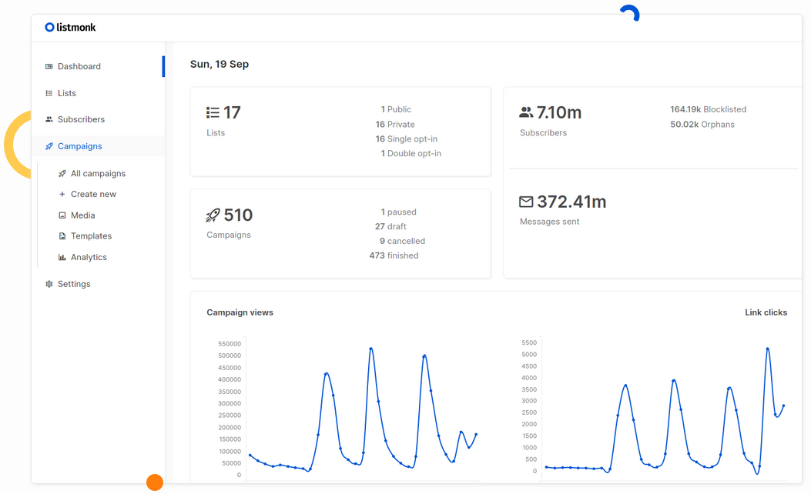

<!--
N.B.: This README was automatically generated by https://github.com/YunoHost/apps/tree/master/tools/README-generator
It shall NOT be edited by hand.
-->

# Listmonk for YunoHost

[](https://dash.yunohost.org/appci/app/listmonk)    
[](https://install-app.yunohost.org/?app=listmonk)

*[Lire ce readme en français.](./README_fr.md)*

> *This package allows you to install Listmonk quickly and simply on a YunoHost server.
If you don't have YunoHost, please consult [the guide](https://yunohost.org/#/install) to learn how to install it.*

## Overview

listmonk is a standalone, self-hosted, newsletter and mailing list manager. It is fast, feature-rich, and packed into a single binary. It uses a PostgreSQL (⩾ v9.4) database as its data store.

### Features

- Ut enim ad minim veniam, quis nostrud exercitation ullamco ;
- Laboris nisi ut aliquip ex ea commodo consequat ;
- Duis aute irure dolor in reprehenderit in voluptate ;
- Velit esse cillum dolore eu fugiat nulla pariatur ;
- Excepteur sint occaecat cupidatat non proident, sunt in culpa."


**Shipped version:** 2.1.0~ynh1

**Demo:** https://demo.listmonk.app/

## Screenshots



## Disclaimers / important information

* Any known limitations, constrains or stuff not working, such as (but not limited to):
    * requiring a full dedicated domain ?
    * architectures not supported ?
    * not-working single-sign on or LDAP integration ?
    * the app requires an important amount of RAM / disk / .. to install or to work properly
    * etc...

* Other infos that people should be aware of, such as:
    * any specific step to perform after installing (such as manually finishing the install, specific admin credentials, ...)
    * how to configure / administrate the application if it ain't obvious
    * upgrade process / specificities / things to be aware of ?
    * security considerations ?

## Documentation and resources

* Official app website: https://listmonk.app/
* Official user documentation: https://yunohost.org/apps
* Official admin documentation: https://listmonk.app/docs/
* Upstream app code repository: https://github.com/knadh/listmonk
* YunoHost documentation for this app: https://yunohost.org/app_listmonk
* Report a bug: https://github.com/YunoHost-Apps/listmonk_ynh/issues

## Developer info

Please send your pull request to the [testing branch](https://github.com/YunoHost-Apps/listmonk_ynh/tree/testing).

To try the testing branch, please proceed like that.
```
sudo yunohost app install https://github.com/YunoHost-Apps/listmonk_ynh/tree/testing --debug
or
sudo yunohost app upgrade listmonk -u https://github.com/YunoHost-Apps/listmonk_ynh/tree/testing --debug
```

**More info regarding app packaging:** https://yunohost.org/packaging_apps